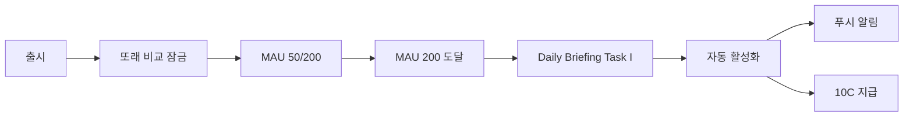

# baln Feature Flag 시스템 구현 가이드 (v1.2)

**작성일**: 2026-02-11
**작성자**: Agent 4 (Technical Architect)
**목적**: Feature Flag 시스템 상세 구현 가이드
**버전**: 1.0 (v1.2 자동 잠금 해제 전략)

---

## 📋 목차

1. [개요](#1-개요)
2. [useFeatureFlag 훅 상세 스펙](#2-usefeatureflag-훅-상세-스펙)
3. [Daily Briefing Task I 구현](#3-daily-briefing-task-i-구현)
4. [잠금 UI 패턴](#4-잠금-ui-패턴)
5. [테스트 방법](#5-테스트-방법)
6. [배포 체크리스트](#6-배포-체크리스트)

---

## 1. 개요

### 목적

v1.2 전략의 핵심: **출시 전 모든 기능 개발 → MAU 임계값 도달 시 자동 활성화**

### 작동 방식



### 장점

| 기존 방식 (v1.1) | v1.2 자동 잠금 해제 |
|-----------------|-------------------|
| MAU 200 도달 → 개발 시작 → 2주 후 출시 | MAU 200 도달 → 즉시 활성화 (같은 날) |
| 기회 놓칠 위험 | 즉각 대응 |
| 수동 모니터링 필요 | 자동 체크 |
| 사용자 불만 ("왜 안 나와?") | 성취감 ("우리가 해냈다!") |

---

## 2. useFeatureFlag 훅 상세 스펙

### 파일 위치
```
src/hooks/useFeatureFlag.ts
```

### 전체 구현 코드

```typescript
/**
 * useFeatureFlag.ts - Feature Flag 훅
 *
 * 역할: "feature_flags 테이블 조회 + Realtime 구독"
 * - enabled 상태 조회
 * - 진행률 계산 (currentMAU / threshold)
 * - Realtime 구독 (enabled 변경 시 자동 refetch)
 */

import { useQuery } from '@tanstack/react-query';
import { supabase } from '@/lib/supabase';
import { useEffect } from 'react';

export interface FeatureFlag {
  enabled: boolean;
  progress: number; // 0~100
  message: string;
}

export type FeatureName = 'peerComparison' | 'fearGreedIndex' | 'accountLinking';

/**
 * Feature Flag 상태 조회 훅
 *
 * @param featureName - 'peerComparison' | 'fearGreedIndex' | 'accountLinking'
 * @returns { enabled, progress, message }
 *
 * @example
 * const peerFlag = useFeatureFlag('peerComparison');
 * if (peerFlag.enabled) {
 *   // 또래 비교 UI 렌더링
 * } else {
 *   // 잠금 UI 렌더링 (progress 표시)
 * }
 */
export function useFeatureFlag(featureName: FeatureName): FeatureFlag {
  const { data, refetch } = useQuery({
    queryKey: ['feature-flag', featureName],
    queryFn: async () => {
      const { data, error } = await supabase
        .from('feature_flags')
        .select('*')
        .eq('name', featureName)
        .single();

      if (error) throw error;
      return data;
    },
    staleTime: 1000 * 60 * 5, // 5분
  });

  // Realtime 구독 (enabled 상태 변경 감지)
  useEffect(() => {
    const channel = supabase
      .channel(`feature-flag-${featureName}`)
      .on(
        'postgres_changes',
        {
          event: 'UPDATE',
          schema: 'public',
          table: 'feature_flags',
          filter: `name=eq.${featureName}`,
        },
        () => {
          console.log(`[FeatureFlag] ${featureName} 변경 감지 → refetch`);
          refetch(); // 변경 감지 시 재조회
        }
      )
      .subscribe();

    return () => {
      supabase.removeChannel(channel);
    };
  }, [featureName, refetch]);

  // 진행률 계산
  const progress = calculateProgress(data);

  return {
    enabled: data?.enabled || false,
    progress,
    message: data?.enabled
      ? '✅ 활성화됨'
      : `🔒 곧 공개됩니다 (${Math.floor(progress)}%)`,
  };
}

/**
 * 진행률 계산 (0~100)
 */
function calculateProgress(flagData: any): number {
  if (!flagData) return 0;

  // MAU 진행률 (임시: 실제는 Daily Briefing에서 계산)
  // TODO: analytics_events에서 실시간 MAU 조회
  const currentMAU = 50; // placeholder
  const mauProgress = (currentMAU / (flagData.threshold_mau || 1)) * 100;

  // 투표 진행률 (fearGreedIndex만 해당)
  if (flagData.name === 'fearGreedIndex') {
    const currentVotes = 120; // placeholder
    const voteProgress = (currentVotes / (flagData.threshold_votes || 1)) * 100;

    // MAU + 투표 둘 다 필요 → 최소값 반환
    return Math.min(mauProgress, voteProgress);
  }

  return Math.min(100, mauProgress);
}
```

### 사용 예시

```typescript
// app/(tabs)/index.tsx
import { useFeatureFlag } from '@/hooks/useFeatureFlag';
import PeerComparisonCard from '@/components/peer/PeerComparisonCard';

export default function HomeScreen() {
  const peerFlag = useFeatureFlag('peerComparison');

  return (
    <ScrollView>
      {/* 기존 컴포넌트들 */}

      {/* 또래 비교 (잠금/활성화 자동 전환) */}
      <PeerComparisonCard
        featureFlag={peerFlag}
        percentile={23} // 사용자 백분위
        userScore={67.3}
        peerAverage={54.2}
      />
    </ScrollView>
  );
}
```

---

## 3. Daily Briefing Task I 구현

### 파일 위치
```
supabase/functions/daily-briefing/task-i-feature-unlock.ts
```

### 전체 구현 코드

```typescript
/**
 * task-i-feature-unlock.ts - 자동 잠금 해제 로직
 *
 * 역할: "MAU 임계값 체크 → 자동 활성화"
 * - 매일 07:00 실행 (Supabase Cron)
 * - enabled = true 업데이트
 * - 푸시 알림 발송
 * - 축하 크레딧 지급
 */

import { SupabaseClient } from '@supabase/supabase-js';

export async function executeTaskI(supabase: SupabaseClient): Promise<void> {
  console.log('[Task I] Feature Flag 자동 해제 시작');

  try {
    // 1. MAU 계산 (최근 30일 유니크 유저)
    const { data: mauData, error: mauError } = await supabase.rpc(
      'calculate_mau'
    );

    if (mauError) throw mauError;

    const currentMAU = mauData || 0;
    console.log(`[Task I] 현재 MAU: ${currentMAU}`);

    // 2. 투표 수 계산 (최근 30일)
    const { count: voteCount, error: voteError } = await supabase
      .from('prediction_votes')
      .select('*', { count: 'exact', head: true })
      .gte('created_at', new Date(Date.now() - 30 * 24 * 60 * 60 * 1000).toISOString());

    if (voteError) throw voteError;

    const totalVotes = voteCount || 0;
    console.log(`[Task I] 총 투표 수: ${totalVotes}`);

    // 3. Feature Flag 조회 (잠금 상태만)
    const { data: flags, error: flagsError } = await supabase
      .from('feature_flags')
      .select('*')
      .eq('enabled', false);

    if (flagsError) throw flagsError;

    // 4. 임계값 체크 & 자동 해제
    for (const flag of flags || []) {
      let shouldUnlock = false;

      if (flag.name === 'peerComparison') {
        shouldUnlock = currentMAU >= (flag.threshold_mau || 200);
      } else if (flag.name === 'fearGreedIndex') {
        shouldUnlock =
          currentMAU >= (flag.threshold_mau || 200) &&
          totalVotes >= (flag.threshold_votes || 500);
      } else if (flag.name === 'accountLinking') {
        // TODO: 평점 체크 추가
        shouldUnlock = currentMAU >= (flag.threshold_mau || 500);
      }

      if (shouldUnlock) {
        console.log(`[Task I] 🎉 ${flag.name} 잠금 해제!`);

        // 4-1. enabled = true 업데이트
        const { error: updateError } = await supabase
          .from('feature_flags')
          .update({ enabled: true, unlocked_at: new Date().toISOString() })
          .eq('name', flag.name);

        if (updateError) throw updateError;

        // 4-2. 모든 유저에게 푸시 알림
        await sendCelebrationPush(supabase, flag.name);

        // 4-3. 축하 크레딧 10C 지급
        await grantCreditToAllUsers(supabase, 10, `${flag.name}_unlock`);

        // 4-4. Analytics 이벤트 로그
        await supabase.from('analytics_events').insert({
          event_type: 'feature_unlocked',
          event_data: {
            feature: flag.name,
            mau: currentMAU,
            votes: totalVotes,
            unlocked_at: new Date().toISOString(),
          },
        });
      } else {
        console.log(`[Task I] ${flag.name} 대기 중 (MAU: ${currentMAU}, 투표: ${totalVotes})`);
      }
    }

    console.log('[Task I] 완료');
  } catch (error) {
    console.error('[Task I] 실행 실패:', error);
    throw error;
  }
}

/**
 * 축하 푸시 알림 발송
 */
async function sendCelebrationPush(
  supabase: SupabaseClient,
  featureName: string
): Promise<void> {
  const messages: Record<string, { title: string; body: string; action: string }> = {
    peerComparison: {
      title: '🎉 사용자 200명 달성!',
      body: '또래 비교 기능이 활성화됐습니다!',
      action: 'open://peer-comparison',
    },
    fearGreedIndex: {
      title: '📊 baln 공포-탐욕 지수 오픈!',
      body: '커뮤니티 심리 지수를 확인해보세요!',
      action: 'open://fear-greed-index',
    },
    accountLinking: {
      title: '🔐 계좌 자동 연동 베타 오픈!',
      body: '이제 자산을 자동으로 업데이트할 수 있어요!',
      action: 'open://settings/account-linking',
    },
  };

  const message = messages[featureName];
  if (!message) return;

  // TODO: expo-notifications를 통한 푸시 발송
  // (현재는 로그만 출력)
  console.log(`[Push] ${message.title} - ${message.body}`);
  console.log(`[Push] Action: ${message.action}`);

  // 실제 구현 예시:
  // const { data: users } = await supabase.from('users').select('push_token');
  // for (const user of users || []) {
  //   await sendPushNotification(user.push_token, message);
  // }
}

/**
 * 모든 유저에게 크레딧 지급
 */
async function grantCreditToAllUsers(
  supabase: SupabaseClient,
  amount: number,
  reason: string
): Promise<void> {
  const { data: users, error } = await supabase
    .from('auth.users')
    .select('id');

  if (error) throw error;

  for (const user of users || []) {
    await supabase.from('user_credits').insert({
      user_id: user.id,
      amount,
      reason,
      created_at: new Date().toISOString(),
    });
  }

  console.log(`[Credit] ${users?.length}명에게 ${amount}C (₩${amount * 100}) 지급 완료`);
}
```

### Daily Briefing index.ts에 통합

```typescript
// supabase/functions/daily-briefing/index.ts

import { serve } from 'https://deno.land/std@0.168.0/http/server.ts';
import { createClient } from 'https://esm.sh/@supabase/supabase-js@2.38.0';
import { executeTaskI } from './task-i-feature-unlock.ts';

serve(async (req) => {
  const supabase = createClient(
    Deno.env.get('SUPABASE_URL')!,
    Deno.env.get('SUPABASE_SERVICE_ROLE_KEY')!
  );

  try {
    // 기존 Task A~H 실행...

    // Task I: Feature Flag 자동 해제
    await executeTaskI(supabase);

    return new Response(JSON.stringify({ success: true }), {
      headers: { 'Content-Type': 'application/json' },
    });
  } catch (error) {
    return new Response(JSON.stringify({ error: error.message }), {
      status: 500,
      headers: { 'Content-Type': 'application/json' },
    });
  }
});
```

### Supabase Cron 설정

```sql
-- Supabase Dashboard > Database > Cron Jobs

SELECT cron.schedule(
  'daily-briefing',
  '0 7 * * *', -- 매일 07:00 (KST 기준 16:00 UTC)
  $$
    SELECT net.http_post(
      url := 'https://PROJECT_ID.supabase.co/functions/v1/daily-briefing',
      headers := '{"Authorization": "Bearer YOUR_ANON_KEY"}'::jsonb
    );
  $$
);
```

---

## 4. 잠금 UI 패턴

### 일관된 잠금 UI 디자인

모든 잠금 기능은 동일한 UI 패턴을 따릅니다:

```
┌─────────────────────────────────┐
│ 🔒 [기능 이름]                  │
├─────────────────────────────────┤
│ [조건] 달성 시 활성화            │
│ 현재 X%                          │
│ ████████░░                       │
└─────────────────────────────────┘
```

### 공통 컴포넌트 추출 (권장)

#### 파일 위치
```
src/components/common/LockedFeatureCard.tsx
```

#### 구현
```typescript
import React from 'react';
import { View, Text, StyleSheet } from 'react-native';
import { Ionicons } from '@expo/vector-icons';
import { useTheme } from '@/hooks/useTheme';

interface LockedFeatureCardProps {
  featureName: string;
  lockMessage: string;
  progress: number; // 0~100
  subMessage?: string;
}

export default function LockedFeatureCard({
  featureName,
  lockMessage,
  progress,
  subMessage,
}: LockedFeatureCardProps) {
  const { colors } = useTheme();

  return (
    <View style={[styles.container, { backgroundColor: colors.card }]}>
      <View style={styles.header}>
        <Ionicons name="lock-closed" size={24} color="#FFB74D" />
        <Text style={[styles.title, { color: colors.text }]}>
          {featureName}
        </Text>
      </View>
      <Text style={[styles.lockMessage, { color: colors.textSecondary }]}>
        🔒 {lockMessage}
      </Text>
      {subMessage && (
        <Text style={[styles.subMessage, { color: colors.textSecondary }]}>
          {subMessage}
        </Text>
      )}
      <View style={styles.progressBarContainer}>
        <View
          style={[
            styles.progressBarFill,
            { width: `${Math.min(100, progress)}%` },
          ]}
        />
      </View>
    </View>
  );
}

const styles = StyleSheet.create({
  container: {
    padding: 16,
    borderRadius: 12,
    marginVertical: 8,
  },
  header: {
    flexDirection: 'row',
    alignItems: 'center',
    marginBottom: 12,
  },
  title: {
    fontSize: 18,
    fontWeight: '700',
    marginLeft: 8,
  },
  lockMessage: {
    fontSize: 16,
    textAlign: 'center',
    marginBottom: 4,
  },
  subMessage: {
    fontSize: 14,
    textAlign: 'center',
    marginBottom: 12,
  },
  progressBarContainer: {
    height: 8,
    backgroundColor: '#333',
    borderRadius: 4,
    overflow: 'hidden',
  },
  progressBarFill: {
    height: '100%',
    backgroundColor: '#4CAF50',
  },
});
```

### 사용 예시

```typescript
// src/components/peer/PeerComparisonCard.tsx

if (!featureFlag.enabled) {
  return (
    <LockedFeatureCard
      featureName="또래 비교"
      lockMessage="200명이 모이면 활성화됩니다"
      progress={featureFlag.progress}
      subMessage={`현재 ${Math.floor(featureFlag.progress)}%`}
    />
  );
}
```

---

## 5. 테스트 방법

### 5-1. 로컬 개발 환경 테스트

#### Step 1: 임계값 조작

```sql
-- Supabase Dashboard > SQL Editor

-- 테스트용 임계값 낮추기
UPDATE feature_flags
SET threshold_mau = 1, threshold_votes = 1
WHERE name = 'peerComparison';

-- 확인
SELECT * FROM feature_flags WHERE name = 'peerComparison';
-- threshold_mau: 1, enabled: false
```

#### Step 2: Daily Briefing Task I 수동 실행

```bash
# Supabase Dashboard > Edge Functions > daily-briefing > Invoke

# 또는 로컬에서 직접 호출
curl -X POST https://PROJECT_ID.supabase.co/functions/v1/daily-briefing \
  -H "Authorization: Bearer YOUR_ANON_KEY"
```

#### Step 3: 결과 확인

```sql
-- enabled = true 확인
SELECT * FROM feature_flags WHERE name = 'peerComparison';
-- enabled: true ✅
-- unlocked_at: 2026-02-11T07:00:00Z ✅

-- Analytics 이벤트 로그 확인
SELECT * FROM analytics_events WHERE event_type = 'feature_unlocked';

-- 크레딧 지급 확인
SELECT * FROM user_credits WHERE reason = 'peerComparison_unlock';
```

#### Step 4: 앱에서 확인

```typescript
// 앱 재실행 또는 Realtime 구독 대기
const peerFlag = useFeatureFlag('peerComparison');
console.log(peerFlag); // { enabled: true, progress: 100, message: '✅ 활성화됨' }
```

#### Step 5: 원복

```sql
-- 테스트 완료 후 원복
UPDATE feature_flags
SET threshold_mau = 200, threshold_votes = NULL, enabled = false, unlocked_at = NULL
WHERE name = 'peerComparison';
```

---

### 5-2. Realtime 구독 테스트

#### 테스트 방법

```typescript
// test-realtime.ts (임시 테스트 파일)

import { supabase } from '@/lib/supabase';

const channel = supabase
  .channel('test-feature-flag')
  .on(
    'postgres_changes',
    {
      event: 'UPDATE',
      schema: 'public',
      table: 'feature_flags',
      filter: 'name=eq.peerComparison',
    },
    (payload) => {
      console.log('🔔 Realtime 변경 감지:', payload);
    }
  )
  .subscribe();

console.log('✅ Realtime 구독 시작');

// 30초 후 자동 종료
setTimeout(() => {
  supabase.removeChannel(channel);
  console.log('⏹ Realtime 구독 종료');
}, 30000);
```

#### 수동 변경으로 트리거

```sql
-- Supabase Dashboard > SQL Editor

-- enabled 토글
UPDATE feature_flags
SET enabled = NOT enabled
WHERE name = 'peerComparison';

-- 앱 콘솔에서 "🔔 Realtime 변경 감지" 메시지 확인
```

---

### 5-3. 푸시 알림 테스트

#### 테스트용 푸시 발송 함수

```typescript
// supabase/functions/test-push/index.ts

import { serve } from 'https://deno.land/std@0.168.0/http/server.ts';

serve(async (req) => {
  // TODO: expo-notifications 통합 후 구현
  return new Response(
    JSON.stringify({ message: '푸시 알림 발송 완료 (테스트)' }),
    { headers: { 'Content-Type': 'application/json' } }
  );
});
```

---

### 5-4. 엣지 케이스 테스트

#### 테스트 시나리오

| 시나리오 | 예상 동작 | 확인 방법 |
|---------|----------|----------|
| MAU = 199 | 잠금 유지 | enabled = false |
| MAU = 200 | 자동 해제 | enabled = true |
| MAU = 200, 투표 499 (fearGreedIndex) | 잠금 유지 | enabled = false |
| MAU = 200, 투표 500 (fearGreedIndex) | 자동 해제 | enabled = true |
| 이미 enabled = true | 중복 처리 안 함 | unlocked_at 변경 없음 |
| Daily Briefing 실패 | 다음 날 재시도 | 크래시 로그 확인 |

---

## 6. 배포 체크리스트

### 출시 전 필수 확인 사항

#### DB 마이그레이션

- [ ] `supabase/migrations/20260211_sleep_cycle_tables.sql` 실행 완료
- [ ] `feature_flags` 테이블 생성 확인
- [ ] 초기 데이터 3개 삽입 확인 (peerComparison, fearGreedIndex, accountLinking)
- [ ] RLS 정책 활성화 확인

#### Edge Function

- [ ] `task-i-feature-unlock.ts` 작성 완료
- [ ] `daily-briefing/index.ts`에 Task I 통합
- [ ] Edge Function 배포 완료 (`supabase functions deploy daily-briefing`)
- [ ] Supabase Cron 설정 완료 (매일 07:00)

#### 앱 코드

- [ ] `src/hooks/useFeatureFlag.ts` 구현 완료
- [ ] `src/components/peer/PeerComparisonCard.tsx` 잠금 UI 구현
- [ ] `src/components/community/FearGreedIndex.tsx` 잠금 UI 구현
- [ ] 홈 탭에 통합 완료
- [ ] TypeScript 에러 0개 (`npx tsc --noEmit`)

#### 테스트

- [ ] 로컬 테스트: 임계값 조작 → 자동 해제 성공
- [ ] Realtime 구독 테스트: enabled 변경 시 자동 refetch
- [ ] 푸시 알림 테스트 (스텁 완료, 실제 발송은 출시 후)
- [ ] 엣지 케이스 테스트 (MAU 199 vs 200)

#### 모니터링

- [ ] Analytics 이벤트 로그 확인 (`feature_unlocked`)
- [ ] Supabase Logs 확인 (Daily Briefing 실행 로그)
- [ ] Sentry 에러 모니터링 설정 (선택사항)

---

## 7. FAQ (자주 묻는 질문)

### Q1. MAU 계산이 정확한가요?

**A**: `calculate_mau()` RPC 함수는 `analytics_events` 테이블의 최근 30일 유니크 `user_id`를 카운트합니다. 정확도를 높이려면:
- 앱 접속 시 `analytics_events`에 이벤트 기록 (`event_type: 'app_open'`)
- 중복 제거 로직 확인 (같은 날 여러 번 접속 = 1명)

### Q2. 푸시 알림이 안 가면 어떻게 하나요?

**A**: 푸시 알림 실패 시에도 앱 내 배너로 대체:
- 홈 탭 상단에 "🎉 또래 비교 활성화!" 배너 표시
- useFeatureFlag 훅이 Realtime으로 변경 감지 → UI 자동 업데이트

### Q3. 여러 Feature Flag가 동시에 해제되면?

**A**: Daily Briefing Task I는 모든 잠금 기능을 순회하므로, 같은 날 여러 기능이 해제될 수 있습니다. 이 경우:
- 푸시 알림 2개 발송 (각각 별도)
- 크레딧도 각각 지급 (10C × 2 = 20C)

### Q4. 테스트 후 enabled를 false로 되돌릴 수 있나요?

**A**: 가능하지만 권장하지 않습니다:
```sql
-- 긴급 롤백 (사용자 혼란 주의)
UPDATE feature_flags SET enabled = false WHERE name = 'peerComparison';
```
- 사용자가 이미 활성화된 UI를 봤다면, 다시 잠그면 불만 발생
- 대신 "일시 중단" 메시지 표시 권장

### Q5. 임계값을 나중에 변경할 수 있나요?

**A**: 가능합니다:
```sql
-- 임계값 상향 (더 많은 사용자 필요)
UPDATE feature_flags SET threshold_mau = 500 WHERE name = 'peerComparison';

-- 임계값 하향 (더 빠른 활성화)
UPDATE feature_flags SET threshold_mau = 100 WHERE name = 'peerComparison';
```
- 이미 enabled = true인 경우 영향 없음 (한 번 해제되면 유지)

---

## 8. 참고 자료

### 관련 문서
- **P0 기술 스펙**: `/Users/nicenoodle/smart-rebalancer/docs/SLEEP_CYCLE_P0_SPEC.md`
- **Sleep Cycle 전략**: `/Users/nicenoodle/baln_sleep_cycle_strategy.md`
- **스프린트 로드맵**: `/Users/nicenoodle/baln_sprint_roadmap.md`

### Supabase 공식 문서
- [Realtime Subscriptions](https://supabase.com/docs/guides/realtime)
- [Edge Functions](https://supabase.com/docs/guides/functions)
- [Cron Jobs](https://supabase.com/docs/guides/database/extensions/pg_cron)

### 코드 예시 위치
- 기존 훅 패턴: `src/hooks/useSharedPortfolio.ts`
- 기존 서비스 패턴: `src/services/centralKitchen.ts`
- 기존 컴포넌트 패턴: `src/components/home/ContextCard.tsx`

---

**작성**: Agent 4 (Technical Architect)
**업데이트**: 2026-02-11
**다음 리뷰**: 출시 7일 전 (Day 13, 최종 조정)
